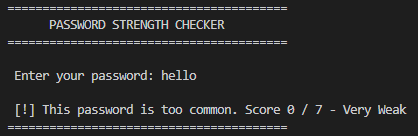
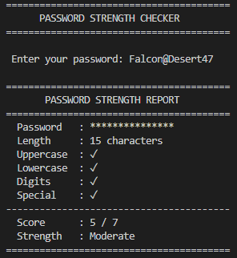
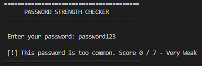

Password Strength Checker

A Python tool that analyzes and rates password strength based on
length, complexity, and commonality.

Features
- Scores passwords out of 7
- Checks for uppercase, lowercase, digits, and special characters
- Detects common passwords from a wordlist
- Clean formatted terminal output

How to Run
1. Clone the repository
2. Run `python checker.py`
3. Enter a password when prompted

Demo

**Weak Password**

**Strong Password**

**Common Password**

What I Learned
- Structuring Python code using functions
- File handling and exception management
- String analysis using the `string` module
